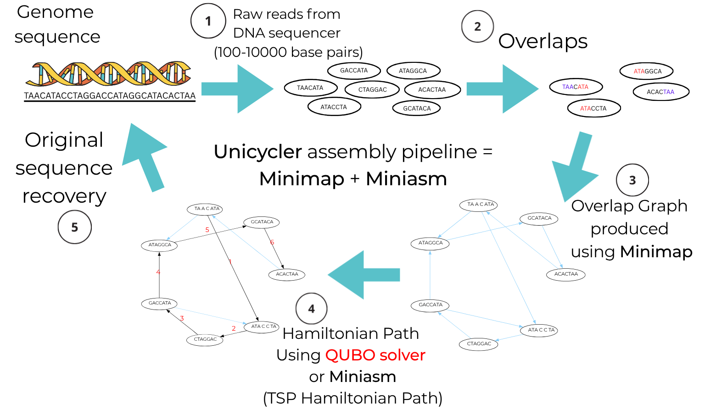
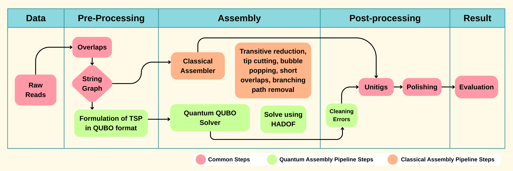
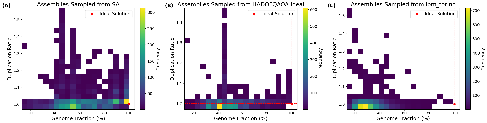

# Quantum-Assisted Genome Assembly Pipeline

This folder contains the full pipeline for assembling a bacterial genome from raw long-read sequencing data, using a quantum (and quantum-inspired) optimisation step in place of the heuristic graph-cleanup normally performed by classical assemblers. The approach, the QUBO formulation, and the results below are described in detail in the accompanying paper:

> **Scaling Quantum Optimisation Beyond Hardware Limits for Real-World Scientific Workloads: Genome Assembly on Current Quantum Hardware**
> Namasi G Sankar, Georgios Miliotis, Simon Caton
> School of Computer Science & Centre for Quantum Engineering, Science and Technology, University College Dublin; Antimicrobial Resistance and Microbial Ecology Group, School of Medicine, University of Galway.

If you use this pipeline or its results, please cite the paper above.

## 1. What this pipeline does

Genome assembly reconstructs an organism's complete DNA sequence from short, overlapping fragments ("reads") produced by a sequencer. Long-read platforms like Oxford Nanopore (ONT) produce reads of 1,000–100,000+ base pairs, which are assembled by:

1. finding **overlaps** between reads,
2. building an **overlap graph** (nodes = reads, edges = overlaps) — also called a *string graph*,
3. finding a path through that graph that visits the reads in genome order (equivalent to a Hamiltonian path / Travelling Salesman Problem), and
4. merging the ordered, overlapping reads into one contiguous sequence.

Step 3 is the computationally hard part: it is NP-hard in general, and classical assemblers such as Unicycler solve it with a sequence of local heuristics (transitive reduction, tip cutting, bubble popping, etc.) rather than an exact or global method. This project replaces that heuristic graph-cleanup step with a **Quadratic Unconstrained Binary Optimisation (QUBO)** formulation of the same problem, solved using:

- **Simulated Annealing (SA)** — a classical baseline,
- **HADOF (Hamiltonian Auto Decomposition Optimisation Framework)** running QAOA (Quantum Approximate Optimisation Algorithm) in an ideal, noise-free simulation, and
- **HADOF running QAOA on real quantum hardware** (IBM's `ibm_torino`, a 133-qubit gate-based processor).

HADOF exists because the QUBO for a realistic assembly graph has far more variables (2,313, for the genome assembled here) than current quantum devices have usable qubits. HADOF decomposes the global QUBO into a sequence of small (here, 5-qubit) sub-problems, solves each on the quantum device, and iteratively merges the results into a global solution — see the "HADOFv2 module" section below.

The dataset used throughout this pipeline is a real *Pseudomonas aeruginosa* genome (7.1 Mbp, circular bacterial chromosome), sequenced with ONT long reads (21,969 reads, accession `ERR13577262`, publicly available via ENA/SRA). This is, per the paper, the largest genome assembled on real quantum hardware to date — roughly 1000x larger than prior quantum genome-assembly demonstrations.

## 2. Pipeline stages, end to end

The pipeline has five stages. The first two columns below are common to both the classical (Unicycler) and quantum (QUBO/HADOF) routes; the middle "Assembly" step is where they diverge; the last two columns are common again.

| Stage | What happens | Where in this repo |
|---|---|---|
| **1. Raw reads** | Raw ONT long reads from the sequencer (FASTQ) | Not stored here — see [Data files](#4-data-files-and-why-some-are-missing) below |
| **2. Pre-processing** | Minimap computes all-vs-all read overlaps; Miniasm (both inside Unicycler) turns the overlaps into a *string graph* in GFA format | Produces `ERR13577262_raw_string.gfa` (524 nodes, 2,313 directed overlap edges for this genome) |
| **3. Assembly (classical branch)** | Miniasm applies transitive reduction, tip cutting, bubble popping, short-overlap cutting, internal-sequence removal, and branching-path removal to collapse the graph into a linear path | Handled entirely inside Unicycler; not reproduced by files in this repo |
| **3. Assembly (quantum branch)** | The string graph is reframed as a Hamiltonian-path / TSP-like problem and encoded as a QUBO (one binary variable per graph edge); the QUBO is solved by SA, or by HADOF-decomposed QAOA (ideal simulation or real quantum hardware) | `AcyclicGraphDNA.py` (QUBO construction, HADOF decomposition groups), `DeBruijnDNA.py` (earlier/simpler De Bruijn-graph QUBO formulation and graph visualisation helper), the `HADOFv2/` package (the actual QAOA/SA solvers — see section 5), driven from **`GAP.ipynb`** |
| **4. Post-processing** | The raw QUBO solution is a *relaxed* graph (not every node has exactly one in/out edge). A depth-first search resolves degree violations and reconnects the graph into a single longest path, which is then written back out as a cleaned GFA and circularised (since *P. aeruginosa*'s chromosome is circular) | `GAP_copy.py` (per-sample DFS cleanup + circularisation), driven by `run_pipeline_copy.sh` |
| **5. Result** | The cleaned path is merged into a single sequence (unitig), polished against the raw reads, trimmed of any circular/terminal redundancy, and evaluated for accuracy | `gfa2unitigs.py` → Racon polishing (external tool, invoked from `run_pipeline_copy.sh`) → `trim_terminal_overlap_reference_free.py` → QUAST evaluation → `merge_reports.py` |

## 3. Walking through the code, in run order

### 3.1 `GAP.ipynb` — the main pipeline notebook

This is the primary entry point for the quantum branch, and runs the whole process **from the string graph through to a finished, evaluated assembly**. It:

1. Loads the string graph (`ERR13577262_raw_string.gfa`) produced by Unicycler's Minimap+Miniasm step.
2. Builds the QUBO from the graph's adjacency structure (`AcyclicGraphDNA.to_qubo`).
3. Either runs the QUBO through `HADOFv2` directly (SA, or HADOF-decomposed QAOA — ideal or on real hardware), or loads a previously computed batch of sampled solutions from one of the `results-*.pkl` files (see below).
4. Post-processes and evaluates the resulting assemblies, producing the `circ_report*.tsv` summary files and the figures used in the paper.

### 3.2 QUBO construction — `AcyclicGraphDNA.py` and `DeBruijnDNA.py`

- **`AcyclicGraphDNA.py`** is the module actually used for the real assembly graph. `to_qubo(adjacency_matrix)` builds an edge-variable QUBO directly from the graph: one binary variable per directed edge, a negative linear term rewarding edge inclusion, and quadratic penalty terms discouraging two edges sharing an in-coming or out-going node (branching). This is the `H_edge` formulation in the paper (Eq. 3) — it uses far fewer variables (`|E|` = 2,313) than the standard permutation-matrix TSP encoding (`N²`), which matters enormously for a quantum-hardware-constrained solve. This file also contains `build_inout_groups`, which partitions the QUBO's variables by shared node (all of a node's out-edges in one group, all of its in-edges in another) for use by HADOF's decomposition.
- **`DeBruijnDNA.py`** implements an earlier, simpler De Bruijn-graph-based QUBO formulation (the standard `N²`-variable permutation-matrix encoding) together with a graph-drawing helper — kept for reference/comparison rather than used in the production pipeline.

### 3.3 `GAP_copy.py` — per-sample reconstruction and cleanup (CLI)

This is the command-line counterpart to the notebook's post-processing, used by `run_pipeline_copy.sh` to process one sampled solution at a time (there are up to 5,000 sampled solutions per solver, per the paper). Given a stored solution vector — either freshly solved or loaded from a `results-*.pkl` file — it:

- reconstructs the corresponding subgraph of the string graph,
- resolves nodes with more than one in/out edge via depth-first search (keeping the longest upstream/downstream path and discarding the rest),
- reconnects nodes left with fewer than one in/out edge,
- circularises the result, and
- writes the cleaned assembly graph out as `output_<sample>.gfa`.

### 3.4 `gfa2unitigs.py` — turning the cleaned graph into a sequence

Takes the cleaned, linear GFA and walks it end to end, stitching each pair of overlapping segments together (using the CIGAR-encoded overlap length from the GFA) to produce a single merged FASTA sequence per connected component. This is the equivalent of Unicycler's own unitig-generation step, applied to the QUBO-derived graph instead.

### 3.5 Polishing (inside `run_pipeline_copy.sh`)

The raw unitig sequence inherits the ~10–15% per-base error rate of the original ONT reads. `run_pipeline_copy.sh` polishes it with three rounds of `minimap2` (re-align the raw reads to the current draft) + `racon` (consensus correction), exactly mirroring the polishing Unicycler itself performs.

### 3.6 `trim_terminal_overlap_reference_free.py` — closing the circular genome

Bacterial chromosomes such as *P. aeruginosa*'s are circular; a linear assembly of a circular genome typically ends up with the start of the sequence duplicated at the end. This script detects and removes that redundancy **without needing a reference genome**: it extracts the first and last 700 kb of the polished assembly, aligns them against each other with `minimap2` (`asm5` preset), and — if it finds a terminal overlap of at least 10 kb with ≥99% identity within 2 kb of either end — trims the longer duplicated copy. This matches the reference-free circularisation procedure described in the paper (Section 3.4.2).

### 3.7 Evaluation and `merge_reports.py`

Each trimmed, polished sample assembly is evaluated against the Unicycler reference assembly (`sequences/assembly.fasta`) using **QUAST**, producing a `report.tsv` per sample that gets copied into `results_columns/<sample>.tsv`. Once all samples for a solver have been processed, **`merge_reports.py`** combines every per-sample `results_columns/*.tsv` into one wide table (one column per sample, one row per QUAST metric) — this is how the `circ_report*.tsv` files in this folder were produced (`circ_report.tsv`, `circ_report_ideal.tsv`, `circ_report_sa.tsv` correspond to the real-device, ideal-HADOF, and SA solver runs respectively).

### 3.8 `run_pipeline_copy.sh` — the driver

Ties sections 3.3–3.7 together for a batch of samples: for each sample index, it calls `GAP_copy.py` to reconstruct and clean that sample's graph, converts it with `gfatools`, unitigs it (`gfa2unitigs.py`), polishes it (`minimap2` + `racon` x3), circular-trims it (`trim_terminal_overlap_reference_free.py`), evaluates it (`quast.py`), and files the QUAST report into `results_columns/`. It finishes by calling `merge_reports.py` to produce a combined report across all processed samples. It expects to be run from this `pipeline/` directory, with the raw reads (`ERR13577262.fastq`) and string graph (`ERR13577262_raw_string.gfa`) present alongside it, and a `results-*.pkl` file of sampled QUBO solutions to draw from.

## 4. Data files, and why some are missing

Some of the files this pipeline needs are too large for a normal GitHub upload and are provided as `.zip` archives instead — **unzip these before running the pipeline**:

| File | Raw size | What it is |
|---|---|---|
| `ERR13577262_raw_string.gfa` (`.zip`) | 33 MB | The Minimap+Miniasm string graph — the shared input to both the classical and quantum branches |
| `results-SA.pkl` (`.zip`) | 218 MB | 5,000 sampled QUBO solutions from Simulated Annealing |
| `results-ideal-HADOF.pkl` (`.zip`) | 336 MB | 5,000 sampled solutions from HADOF+QAOA, ideal noise-free simulation |
| `results-real-device.pkl` (`.zip`) | 336 MB | Sampled solutions from HADOF+QAOA on real `ibm_torino` hardware |

**`ERR13577262.fastq`**, the raw ONT read set (~464 MB, 21,969 reads), is **not included in this repository at all**. It is public sequencing data, archived under run accession [`ERR13577262`](https://www.ebi.ac.uk/ena/browser/view/ERR13577262) on the European Nucleotide Archive (which mirrors/shares accessions with NCBI's SRA) — download it from there rather than from this repo. 

`sequences/assembly.fasta` is the Unicycler reference assembly (7,139,404 bp) used as the ground truth for QUAST evaluation throughout.

## 5. The `HADOFv2/` module

`HADOFv2/` (a sibling folder to `pipeline/`) contains the actual optimisation engine that `GAP.ipynb` calls into:

- **`HADOFrun.py`** — top-level entry point (`main()`), which drives the sweep-by-sweep decomposition loop described in the paper (Figure 3): at each iteration, a set of small variable subsets is chosen, a sub-QUBO is built for each using the current global probability estimate for every inactive variable, each sub-QUBO is optimised on a k-qubit circuit, and the results are merged back into the global solution.
- **`HADOF/sequentialHADOF.py`** / **`HADOF/parallelHADOF.py`** — the sequential (Gauss-Seidel-style, immediate-update) and parallel (Jacobi-style, batch-update) variants of the decomposition loop.
- **`problem_solver/`** — the actual quantum/annealing back ends: `QAOAt.py` (trotterised QAOA, the one used for all results in the paper), `QAOAc.py` (continuous-parameter QAOA), `QAOAt_qiskit.py` (Qiskit-backed variant, used for the real `ibm_torino` runs), and `falqon.py` (FALQON, an alternative variational initialisation strategy).
- **`problem_generator/`** — synthetic test problems (Knapsack, TSP, generic QUBO-dict loading) used for validating HADOF independently of the genome-assembly use case.

For the headline results in the paper, HADOF was configured with 5-qubit sub-circuits, `QAOAt` as the optimiser, and an "ordered" (contiguous block) selection strategy — 462 five-qubit circuits plus one 3-qubit circuit to cover all 2,313 QUBO variables, against a device with 133 physical qubits.

## 6. Headline results (from the paper)

Benchmarked against the Unicycler classical baseline (509 nodes retained, 7,139,404 bp, QUBO score −1018):

| Solver | Retained nodes (post-cleanup) | Final assembly length | Genome fraction | Duplication ratio |
|---|---|---|---|---|
| Unicycler (classical baseline) | 509 | 7,139,404 bp | 100% | 1.0 (reference) |
| Simulated Annealing (best sample) | 245 | 7,139,412 bp | 100% | 1.0 |
| HADOF + QAOA, ideal simulation (best sample) | 263 | 7,139,426 bp | 100% | 1.0 |
| HADOF + QAOA, real `ibm_torino` hardware (best sample) | 206 | 7,094,589 bp | **99.348%** | 1.0 |

Across 5,000 sampled solutions per solver, 398 SA samples, 48 ideal-HADOF samples, and 2 real-hardware samples achieved >95% genome fraction with a duplication ratio below 1.05 — with 106 SA samples and 3 ideal-HADOF samples reconstructing the reference genome exactly (100% fraction, 1.0 duplication ratio). The paper's key finding is that the raw QUBO objective value is a poor proxy for assembly quality on its own — the number of nodes retained after post-processing correlates far more strongly with genome fraction (see the paper's Section 4.4 for the full analysis).

## 7. Running the pipeline

1. Unzip the large data files listed in [section 4](#4-data-files-and-why-some-are-missing) in place.
2. Download `ERR13577262.fastq` from ENA/SRA and place it alongside the other files in this folder.
3. Open `GAP.ipynb` to run the full pipeline interactively (QUBO construction → HADOF/SA solving → post-processing → evaluation), or
4. Run `bash run_pipeline_copy.sh` to (re-)process a batch of already-sampled solutions (from a `results-*.pkl` file) through cleanup, unitigging, polishing, circular trimming, and QUAST evaluation.

Requires `Unicycler`, `gfatools`, `minimap2`, `racon`, and `quast.py` on the `PATH`, plus the Python dependencies used by `HADOFv2/` (see that folder).
